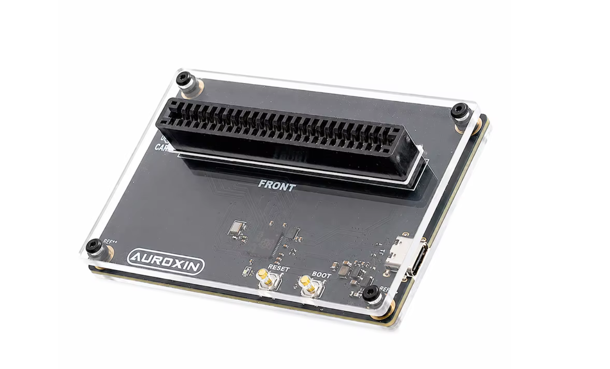
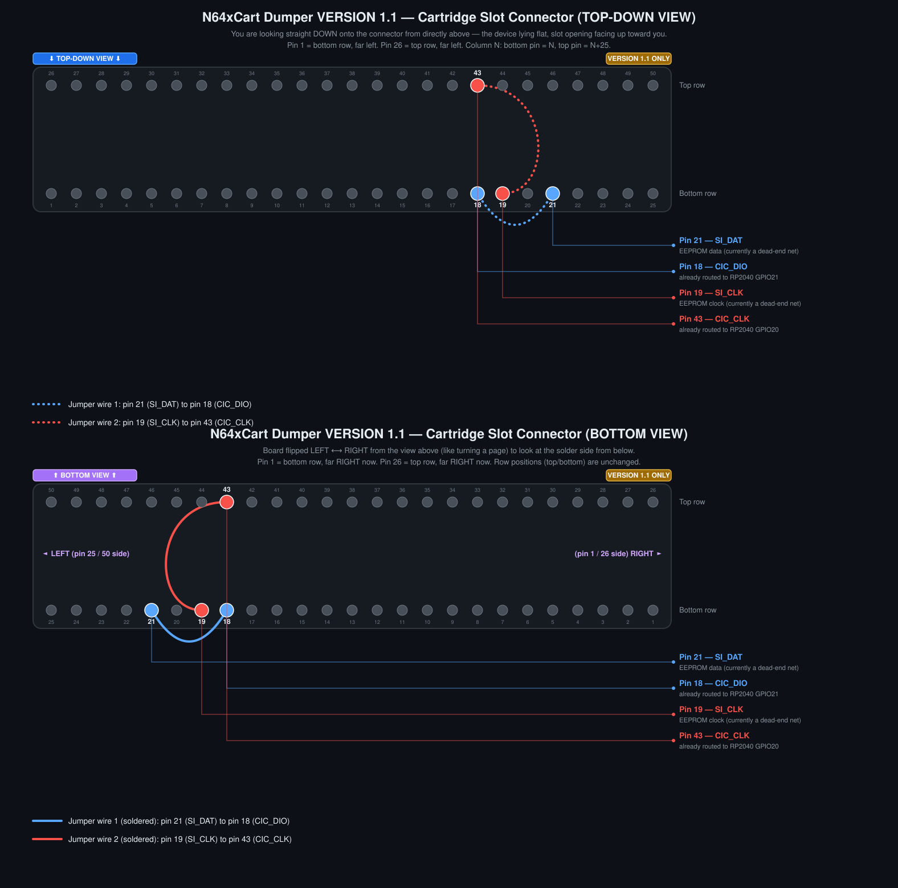
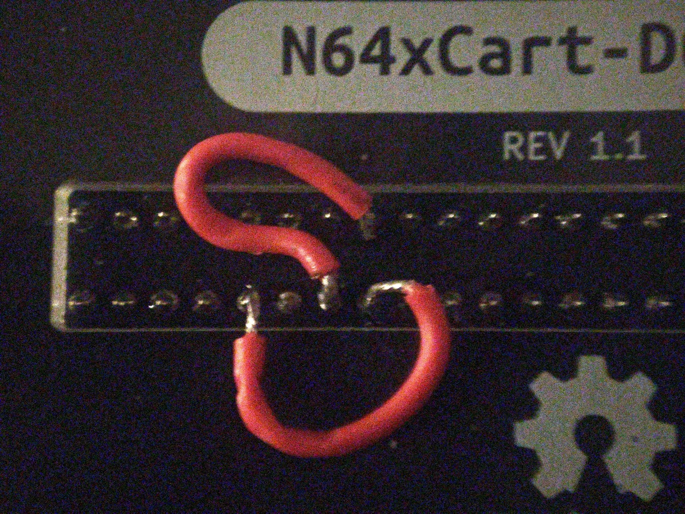
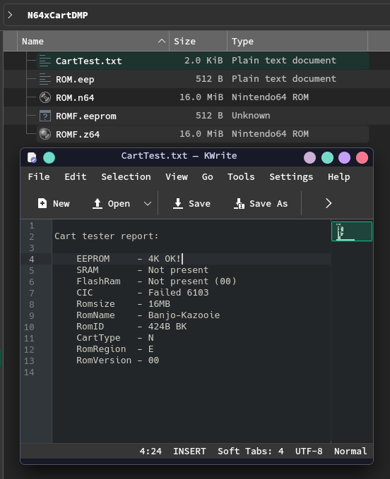

# N64xCart Dumper

N64xCart Dumper is an open hardware / firmware project for dumping Nintendo 64 cartridges as a USB mass storage device. It is based on the excellent DreamDumper64 project and the `DrmDmp64_mass` firmware, with changes for the N64xCart Dumper hardware.

<p align="center">
  
</p>
## Project Status

This repository contains:

- `firmware/N64xCartDumper/` - RP2040 firmware adapted for the N64xCart Dumper board.
- `hardware/PCB/` - KiCad schematic and PCB layout.
- `hardware/production/` - production files for PCB manufacturing.
- `extras/` - extra project files, if any.

The device appears to the computer as a USB mass storage device. The virtual FAT16 disk exposes N64 cartridge data and save data files such as ROM, EEPROM, SRAM and FlashRAM where supported by the firmware.

## Origin and Credits

This project exists because of prior open source work. Please visit and support the original authors:

- N64xCart-Dumper by Auroxin: https://github.com/Auroxin/N64xCart-Dumper
- DreamDumper64 hardware project by khill25: https://github.com/khill25/Dreamdumper
- `DrmDmp64_mass` firmware by nopjne: https://github.com/nopjne/drmdmp64_mass
- TinyUSB USB stack: https://github.com/hathach/tinyusb
- Raspberry Pi Pico / RP2040 SDK ecosystem: https://github.com/raspberrypi/pico-sdk

My changes are focused on adapting the firmware and hardware layout for the N64xCart Dumper board, including the PCB layout, production files, and acrylic enclosure design.


## Hardware

The hardware in this repository was redrawn and laid out for the N64xCart Dumper form factor while following the DreamDumper64 hardware principles.

Current hardware files:

- KiCad project: `hardware/PCB/N64xCartDumper-v1.1.kicad_pro`
- Schematic: `hardware/PCB/N64xCartDumper-v1.1.kicad_sch`
- PCB layout: `hardware/PCB/N64xCartDumper-v1.1.kicad_pcb`
- Production archive: `hardware/production/N64xCart-Dumper-v1.1-20260612.zip`

## VERSION 1.1 Boards — EEPROM Workaround

On VERSION 1.1 boards, the dedicated EEPROM pins are not actually routed to the RP2040 (dead-end nets) ((as far as Claude Code can tell at least)). To get working EEPROM saves on these boards, two jumper wires need to be soldered onto the cartridge slot connector, bridging the EEPROM lines onto pins that are already routed (shared with the CIC lines), and the firmware needs the accompanying EEPROM/CIC pin-sharing changes to go with it.

<p align="center">
  
</p>

Jumper wires needed:

- Jumper wire 1: pin 21 (SI_DAT / EEPROM data) → pin 18 (CIC_DIO) — both bottom row, side-to-side.
- Jumper wire 2: pin 19 (SI_CLK / EEPROM clock) → pin 43 (CIC_CLK) — bottom row to top row, across the connector.

### Soldering instructions

1. Confirm your board is actually a VERSION 1.1 board before doing anything. (Should have `REV 1.1` printed on the bottom)
2. With the board powered off, locate cartridge slot pins 18, 19, 21, and 43. Use the bottom (solder-side) view in the diagram above — pin numbering mirrors left/right once you flip the board over. I took off the acrylic board cover when doing this step.
3. Solder jumper wire 2 (pin 19 to pin 43, top-to-bottom across the connector).
4. Solder jumper wire 1 (pin 21 to pin 18, side-to-side along the bottom row).
5. Check for solder bridges to adjacent pins before powering the board back on.
6. Flash a firmware build that includes the EEPROM RAM-cache patch and the `cartio_init()` reorder — the jumpers alone don't help unless the firmware also claims the pins in the right order.

### Expected results

<p align="center">
  
  
</p>

EEPROM reads back `##K OK!` after the jumpers are installed and this firmware is flashed.

One caveat: the `CIC` line in the report seems to always show `Failed` after this workaround. As far as I can tell that doesn't actually harm anything — the checksums of the ROMs I've backed up match what they should be, and the saves I've pulled off have worked too.

### Disclaimer

This modification (diagram, wiring, and the accompanying firmware changes) was put together with AI assistance and may not reflect best practices. I take no responsibility for damaged cartridge readers, damaged cartridges, corrupted or lost save data, or anything else that results from following these instructions. Solder at your own risk.

That said — it does work for me, on my own VERSION 1.1 board.

## Firmware

The firmware is based on `DrmDmp64_mass`, a mass storage device firmware for DreamDumper64. It has been modified for the N64xCart Dumper hardware.

Important local changes include:

- USB product strings changed to `N64xCart Dumper`.
- Hardware pin and LED configuration adapted for this board.
- Virtual disk label/product information updated for N64xCart Dumper.
- Project files arranged under `firmware/N64xCartDumper/`.

## Building Firmware

The active firmware build entry is the CMake project in `firmware/N64xCartDumper/`.

Typical build flow:

```sh
cd firmware/N64xCartDumper
mkdir build
cd build
cmake ..
cmake --build .
(optional) put pico in bootloader mode and copy the N64xCartDumper.uf2 to the attached drive.
```

You will need a working Raspberry Pi Pico / RP2040 build environment, including the Pico SDK, CMake, a supported ARM GCC toolchain, and the TinyUSB dependencies used by this project.

Note: the included `Makefile` appears to be inherited from an earlier TinyUSB example layout and may not match the current source file names. Prefer the CMake build unless you intentionally update the Makefile.

## Buying a Finished Unit

I also sell assembled N64xCart Dumper units on AliExpress. Buying one helps support the time spent on PCB layout, testing, assembly, enclosure design, and continued open source maintenance.

- Support Us: [Product Link](https://www.aliexpress.com/item/1005012654363194.html)

Thank you for supporting this project. If you build your own, improve the design, or find a bug, contributions and feedback are welcome.

## License Notes

This repository contains code and design work derived from other open source projects. Please check the original projects and bundled third-party files for their license terms:

- `DrmDmp64_mass`: https://github.com/nopjne/drmdmp64_mass
- DreamDumper64: https://github.com/khill25/Dreamdumper
- TinyUSB license file included at `firmware/N64xCartDumper/external/tinyusb/LICENSE`

Source files inherited from `DrmDmp64_mass` include their original copyright and license headers. New N64xCart Dumper hardware files and modifications should be used with respect for the upstream projects and their licenses.

## Disclaimer

This is an independent hobbyist/open hardware project. It is not affiliated with or endorsed by Nintendo. Use it only with cartridges and data you legally own and are allowed to back up under your local laws.

